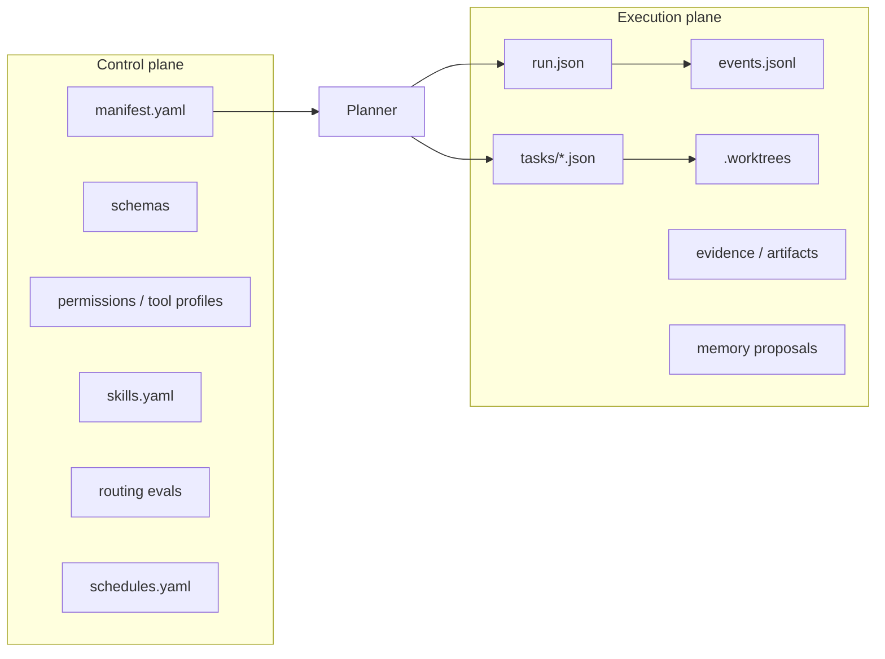

# Multi-Agent Orchestration Platform

> **Canonical manifest:** [`.grok/orchestration/manifest.yaml`](../../.grok/orchestration/manifest.yaml)  
> **Human role narrative:** [`ROLES.md`](./ROLES.md) (explains the manifest; does not own a second registry)  
> **Quality gate:** [`QUALITY_REVIEW.md`](./QUALITY_REVIEW.md)

## 1. Problem statement

Smart Parking already had a strong **human-readable** multi-agent process (roles ①–⑫, activation tables, Quality last). It lacked an **enforceable** control plane: routing lived in docs *and* shell greps, runs were Markdown-only, and nothing validated permissions, retries, or evidence.

## 2. Current vs target

| Before | After |
|--------|-------|
| Docs + shell greps | One YAML manifest + planner |
| Markdown status as truth | `run.json` + tasks + generated `status.md` |
| Duplicate PR comments | Single upsert comment with marker |
| No routing tests | Fixture suite with precision/recall |
| Implicit safety | Permissions, tool profiles, blocked commands |
| No provider boundary | Mock / local-prompt / vendor stubs |

## 3. Control plane vs execution plane



## 4. Deterministic routing

`scripts/agents/plan-run.mjs` maps changed files → agents using **static rules only**:

- Path globs and keywords from the manifest
- Always-on orchestrator + quality
- Testing when production behavior changes
- Database before core-api when schema touched
- Quality always last in the task graph
- Never parallelize overlapping write scopes

LLM providers may implement **tasks**, not **routing**.

### Orchestration patterns

| Pattern | When |
|---------|------|
| `deterministic-routing` | Clear single-domain change |
| `sequential` | Ordered dependencies |
| `concurrent-read-analysis` | Independent read/review work |
| `evaluator-optimizer` | Test + quality loop emphasis |
| `hybrid` | Multi-writer with mixed parallel/serial |
| `adaptive-investigation` | Unknown paths, no specialist ownership |

## 5. Task state machine

```text
CREATED → PLANNED → READY → RUNNING → VERIFYING → SUCCEEDED
                              ↓           ↓
                           FAILED ←———————
                              ↓
                    READY (retry if attempts remain)
                              ↓
                    BLOCKED / ESCALATED / CANCELLED
```

Invalid transitions are rejected in `update-task-state.mjs`.

## 6. Worktree isolation

Writing tasks may use `.worktrees/<run>/<task>` on branch `agent/<run>/<task>`.

- Parallel writes ⇒ separate worktrees
- Orchestrator owns integration (`integrate-task-result.mjs`)
- Cleanup refuses dirty trees unless `--force --allow-dirty`

## 7. Permissions and tool profiles

- Path scopes: manifest `writePaths` / `deniedPaths`
- Global blocks: `permissions.yaml` (force-push, migrate reset, DROP DATABASE, …)
- Profiles: `tool-profiles.yaml` (e.g. `quality-review` cannot implement features)

## 8. Provider adapters

```text
scripts/agents/providers/
  provider.mjs      # interface + normalizeResult
  mock.mjs          # tests
  local-prompt.mjs  # prompt only, no network
  codex.mjs|claude.mjs|grok.mjs  # block without credentials
```

**Never claim an external model ran when only mock/local-prompt was used.**

## 9. Memory governance

| Tier | Writable by | Notes |
|------|-------------|-------|
| `reference/` | humans only | curated |
| `run-scratch/` | agents | disposable |
| `proposals/` | agents | evidence required |
| `promoted/` | quality/human | expiry + reviewer |

External web content is **untrusted** and never auto-promoted.

## 10. Skills governance

Skills are versioned capabilities in `skills.yaml` (not every prompt). Active skills are validated for coexistence (no contradictory hard rules).

## 11. Scheduling

`schedules.yaml` entries must point at a real GitHub workflow. Defaults: **read-only / report-only**. Never merge, deploy, or rotate secrets from a schedule.

## 12. Observability and recovery

- Append-only `events.jsonl`
- `summarize-run.mjs` / `inspect-run.mjs` metrics
- Resume via `orchestrate-run.mjs --resume <run-id>`
- Terminal failures must state what/why/attempts/evidence/recovery/repo-safety

## 13. Security model

Enforced in code (not prompts alone):

- Path traversal rejection
- Shell metacharacter strict mode
- Secret-like path writes blocked
- Secret patterns in memory proposals
- Provider blocks without credentials
- Quality cannot write feature paths

## 14. External guidance — adapted, not copied

| Source | General idea adopted | What we did **not** copy |
|--------|----------------------|---------------------------|
| [Building an Agentic System](https://gerred.github.io/building-an-agentic-system/index.html) | Control vs execution, multi-agent patterns | Framework lock-in |
| [Multi-agent orchestration ch.10](https://gerred.github.io/building-an-agentic-system/second-edition/part-iv-advanced-patterns/chapter-10-multi-agent-orchestration.html) | Orchestrator + specialists | Runtime product claims |
| [Claude managed agents memory](https://platform.claude.com/docs/en/managed-agents/memory) | Tiered memory, promotion | Claude API limits as ours |
| [Claude multiagent orchestration](https://platform.claude.com/docs/en/managed-agents/multiagent-orchestration) | Lead/worker split | Vendor scheduling semantics |
| [Claude scheduled deployments](https://platform.claude.com/docs/en/managed-agents/scheduled-deployments) | Explicit schedules + pause | Claude deployment product |
| [Claude agent skills](https://platform.claude.com/docs/en/agents-and-tools/agent-skills/enterprise) | Versioned skills | Enterprise SKU constraints |
| [Azure AI agent patterns](https://learn.microsoft.com/en-us/azure/architecture/ai-ml/guide/ai-agent-design-patterns) | Pattern catalog | Azure service coupling |
| [AI agents at scale](https://learn.microsoft.com/en-us/azure/architecture/solution-ideas/articles/ai-agents-at-scale) | Isolation & governance | Cloud-only topology |
| [AIMultiple orchestration](https://aimultiple.com/agentic-orchestration) | Taxonomy of orchestration | Marketing claims as design |
| [Augment multi-agent guide](https://www.augmentcode.com/guides/multi-agent-orchestration-architecture-guide) | Architecture checklists | Tool-specific workflow |

**Local translation:** GitHub Actions + Node.js scripts + YAML/JSON artifacts in-repo. No hosted agent cloud required.

## 15. Tradeoffs and rejected alternatives

| Choice | Why | Rejected |
|--------|-----|----------|
| Deterministic routing | Auditable, testable, cheap | LLM router for paths |
| YAML manifest | Human + machine readable | Multiple JSON registries |
| Worktrees | Parallel write isolation | Shared dirty checkout |
| JSONL events | Append-only, greppable | Required external OTEL |
| One package under `scripts/agents` | Minimal monorepo impact | New polyglot service |
| Mock/local-prompt first | Safe CI | Live model calls in CI |

## 16. Testing ownership (updated)

- **Implementation agents** may write unit/contract tests tightly coupled to their change.
- **Testing agent (⑨)** independently audits coverage, adds regression/integration/E2E, negative paths, cross-service contracts.
- **Quality (⑤)** evaluates code + tests + evidence; issues APPROVE / APPROVE_WITH_NOTES / BLOCK; never silently becomes feature implementer.

## 17. Quick demo

See [`docs/interview/MULTI_AGENT_SYSTEM_DEMO.md`](../interview/MULTI_AGENT_SYSTEM_DEMO.md).
