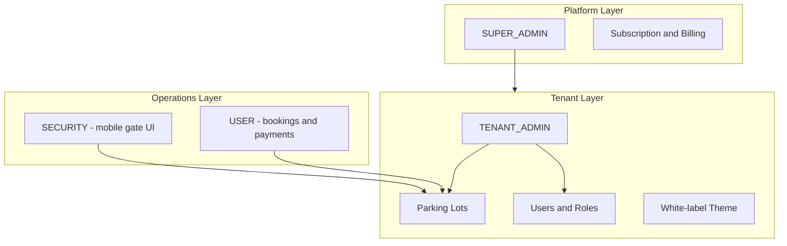

# Architecture — Multi-Tenant SaaS

## High-level layers



## Proposed role hierarchy

| Role | Scope | Capabilities |
|------|-------|--------------|
| SUPER_ADMIN | Platform | Create tenants, manage subscriptions, platform analytics |
| TENANT_ADMIN | One tenant | All lots under tenant, billing, tenant settings, branding |
| ADMIN | One or more lots | Lot config, users, reports, payments |
| SECURITY | Assigned lots | Check-in, check-out, view active sessions |
| USER | Self | Own vehicles, bookings, payments |

Current codebase has ADMIN, SECURITY, USER only — tenant and platform roles are **not yet implemented**.

## Multi-tenancy model (recommended)

### Organization / Tenant entity

```text
Organization
  id, name, slug, logoUrl, primaryColor
  plan, maxLots, maxUsers, isActive
  createdAt, updatedAt
```

### Data scoping rule

Every tenant-owned record gets `organizationId`:

```text
ParkingLot, Floor, Slot, User (tenant-scoped), Booking,
ParkingEvent, Payment (via event), SlotAssignment
```

Platform-level users (SUPER_ADMIN) bypass tenant scope via explicit policy.

### Isolation strategy

**Recommended for v1:** shared database, row-level `organizationId` on all tenant tables.

- Simpler ops and lower cost for early customers
- Prisma middleware or NestJS guard enforces tenant on every query
- JWT carries `organizationId` (and `role`)

**Future option:** schema-per-tenant or DB-per-tenant for enterprise tier.

## White-label theming

MUI `ThemeProvider` already exists (`frontend/src/theme.ts`).

Per-tenant overrides:

```text
primary color  → palette.primary.main
logo           → AppLayout sidebar + login page
app name       → "Acme Parking" instead of "Smart Parking"
```

Load tenant theme after auth from `GET /organizations/:id/branding` or embed in JWT claims.

## API tenancy

- Subdomain: `acme.smartparking.app` → resolve tenant by slug
- Or path prefix: `/api/v1/...` with `X-Tenant-Id` header (dev/staging)
- All list/detail endpoints filter by `organizationId` automatically

## Subscription hooks (future-ready)

```text
Plan: STARTER | PRO | ENTERPRISE
Limits: maxParkingLots, maxUsers, features (heatmap, slotMap, razorpay, reports)
```

Enforce limits at create endpoints (e.g. block new lot if at plan cap).

## Tech stack (unchanged)

```text
backend/          NestJS + Prisma + MySQL
payment-service/  Spring Boot + MySQL + Razorpay
frontend/         React + TypeScript + Vite + MUI + React Query
```