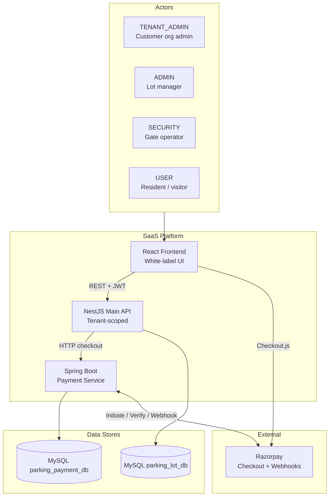
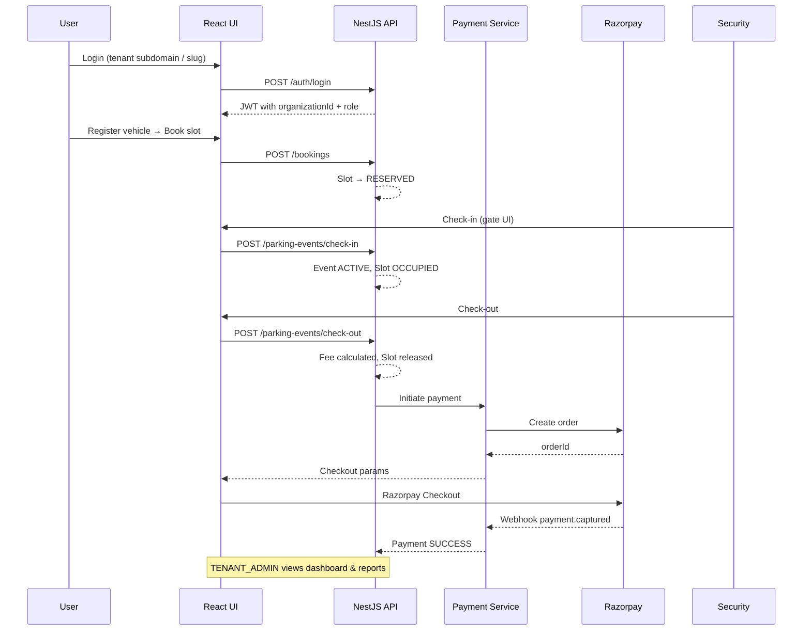

# HLD v2 — Multi-Tenant Smart Parking SaaS

**Supersedes:** [06-hld-current-system.md](./06-hld-current-system.md) for all new development.

**Visual diagram:** [diagrams/hld-saas-v2.svg](./diagrams/hld-saas-v2.svg)

## Title

**Smart Parking SaaS — High Level System Design v2**  
React Frontend + NestJS Main API + Spring Boot Payment Service + Razorpay

---

## System context



---

## Layer model

| Layer | Who | Responsibility |
|-------|-----|----------------|
| **Tenant** | TENANT_ADMIN | Org settings, branding, all lots under org |
| **Operations** | ADMIN, SECURITY | Day-to-day lot management and gate ops |
| **End user** | USER | Vehicles, bookings, own payments |

Every tenant-scoped record carries `organizationId`. JWT includes `organizationId`, `role`, and optional `lotIds`.

---

## Frontend (React + TypeScript + Vite + MUI)

| Surface | Audience | Features |
|---------|----------|----------|
| Tenant admin | TENANT_ADMIN | Branding, users, subscription, all lots |
| Operator dashboard | ADMIN | Occupancy, revenue, heatmap, reports |
| **Visual slot map** | ADMIN, SECURITY | Floor grid, live slot colors |
| **Mobile gate** | SECURITY | Large check-in / check-out, search |
| User portal | USER | Vehicles, bookings, payments, history |

**Cross-cutting**

- Dynamic theme per tenant (logo, name, primary color)
- Role-based navigation (existing `AppLayout`)
- REST via centralized API clients
- Razorpay Checkout.js on payment screen

---

## Main Backend (NestJS + Prisma)

| Module | Responsibility |
|--------|----------------|
| **Organizations** | Tenant CRUD, onboarding, plan limits |
| Auth & RBAC | JWT, tenant guard, role guards, DTO validation |
| Parking Lots / Floors / Slots | Structure + slot lifecycle (all scoped by org) |
| Vehicles | Per-user registry within tenant |
| Bookings | Reserve slot → RESERVED |
| Parking Events | Check-in ACTIVE / check-out COMPLETED |
| Dashboard / Reports | Occupancy, sessions, revenue (tenant-scoped) |

**ORM:** Prisma → MySQL `parking_lot_db`

**Core entities**

```text
Organization, User, ParkingLot, Floor, Slot,
Vehicle, Booking, ParkingEvent, SlotAssignment
```

**Tenant enforcement**

- NestJS `TenantGuard` reads `organizationId` from JWT
- Prisma middleware or service-layer filter on every query

---

## Payment Service (Spring Boot)

| Capability | Notes |
|------------|-------|
| Initiate Payment | Creates Razorpay order; returns orderId to frontend |
| Verify Payment | Signature check after checkout |
| **Razorpay Webhook** | `payment.captured`, `payment.failed` → update status |
| Mock Success / Failure | Dev / demo only |
| Payment History | Scoped by tenant + user |
| Reports Summary | Revenue per tenant / lot |

**ORM:** JPA → MySQL `parking_payment_db`

**Entities:** Payment, PaymentStatus, ProviderReference, organizationId (new)

**Calls:** NestJS invokes payment service at check-out; payment service calls Razorpay APIs.

---

## Databases

### parking_lot_db (main)

```text
organizations
users            (+ organizationId, expanded Role enum)
parking_lots     (+ organizationId)
floors, slots, vehicles, bookings, parking_events, slot_assignments
```

### parking_payment_db (payments)

```text
payments         (+ organizationId for tenant reports)
payment_status_history
provider_references
```

---

## End-to-end business flow (SaaS)



### Steps (numbered)

1. Tenant onboarded via public signup (org + TENANT_ADMIN created)
2. User logs in under tenant context (branded login page)
3. User registers vehicle
4. User books available slot → slot **RESERVED**
5. Security / Admin **check-in** → event **ACTIVE**, slot **OCCUPIED**
6. Security / Admin **check-out** → fee calculated, slot **AVAILABLE**
7. NestJS calls Payment Service → Razorpay order created
8. User pays via Razorpay Checkout (or mock in dev)
9. Webhook / verify updates payment → **SUCCESS**
10. TENANT_ADMIN / ADMIN views occupancy dashboard & revenue reports

---

## Key rules

| Role | Can | Cannot |
|------|-----|--------|
| TENANT_ADMIN | All lots in org, branding, tenant users | Other tenants' data |
| ADMIN | Lot config, reports, check-in/out | Other orgs |
| SECURITY | Check-in/out, active events, gate UI | Admin settings, mock payments |
| USER | Own vehicles, bookings, payments | Other users' data, technical IDs in tables |

**Lifecycle**

- Booking → reserves slot
- Check-in → ACTIVE event + OCCUPIED slot
- Check-out → COMPLETED event + released slot + payment initiated
- Payment SUCCESS → receipt available in history

---

## Subscription & limits (Phase 6)

```text
Plan: STARTER | PRO | ENTERPRISE
Enforced at API: maxParkingLots, maxUsers, featureFlags
```

---

## Migration from v1 HLD

| v1 (basic) | v2 (SaaS) |
|------------|-----------|
| 3 roles | 5 roles (+ platform + tenant admin) |
| Single deployment | Multi-tenant `Organization` |
| One brand | White-label per tenant |
| Tables only | + Visual slot map + mobile gate |
| Mock payments | Razorpay + webhooks |
| Admin dashboard | Operator dashboard + heatmap + revenue |

---

## Diagram files

| File | Description |
|------|-------------|
| [hld-current-system.jpg](./diagrams/hld-current-system.jpg) | Original v1 diagram (archived) |
| [hld-saas-v2.svg](./diagrams/hld-saas-v2.svg) | **Current** printable HLD poster |