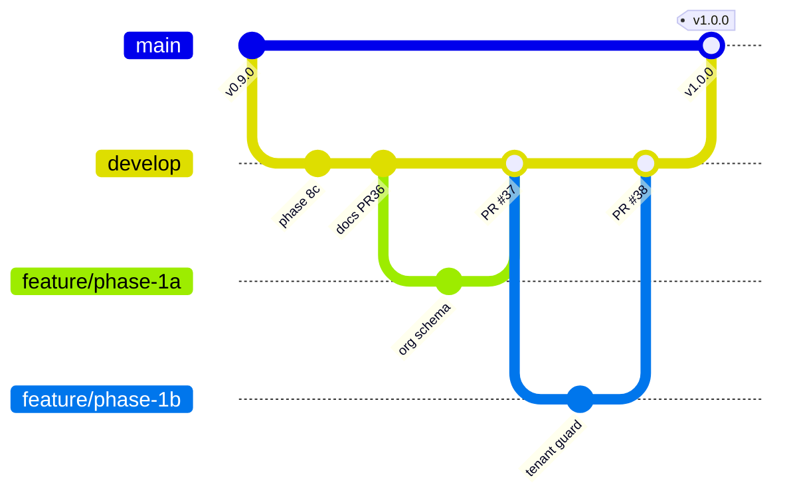

# Branch Strategy — State of the Art (2026)

**Model name:** Trunk-Based Delivery on `develop` with Protected Production on `main`  
**Applies to:** Smart Parking SaaS monorepo (NestJS + React + Spring Boot)  
**Aligned with:** GitHub branch protection, 3-job CI, phased SaaS roadmap

---

## 1. Strategy in one sentence

**Integrate early and often on `develop` via small, short-lived branches; ship stable slices to `main` only at versioned release milestones.**

This combines the best of **trunk-based development** (fast integration, small PRs) with **GitFlow-lite** (protected production branch) — the pattern used by high-velocity SaaS teams that cannot afford long-lived feature branches or direct-to-main chaos.

---

## 2. Why this model (vs alternatives)

| Model | Verdict | Reason |
|-------|---------|--------|
| **Pure GitFlow** (`develop` + `release` + `hotfix` + `feature`) | ❌ Too heavy | Release branches add overhead for a small team shipping weekly |
| **GitHub Flow** (only `main`) | ❌ Too risky | No integration trunk; every PR hits production branch |
| **Pure trunk** (commit to `main` daily) | ❌ Blocked by your setup | You need `develop` for multi-service integration + CI |
| **Long-lived feature branches** | ❌ Merge hell | Phase 1 tenancy across 3 services will diverge fast |
| **Trunk-based on `develop` + release to `main`** | ✅ **Chosen** | Matches protected `develop`, CI on PR, SaaS phase roadmap |

---

## 3. Branch hierarchy



### Permanent branches

| Branch | Role | Deploy target | Protection |
|--------|------|---------------|------------|
| **`main`** | Production truth | Live / pilot customers | PR required, CI required, no direct push |
| **`develop`** | Integration trunk | Dev / staging environment | PR required, 3 CI checks, no direct push |

### Short-lived branches (delete after merge)

| Prefix | Purpose | Base | Merge into |
|--------|---------|------|------------|
| `feature/` | New capability | `develop` | `develop` |
| `fix/` | Bug fix (non-prod) | `develop` | `develop` |
| `docs/` | MASTER_PROMPT, plan, HLD only | `develop` | `develop` |
| `refactor/` | No behavior change | `develop` | `develop` |
| `release/` | Stabilization before tag (optional) | `develop` | `main` + back-merge `develop` |
| `hotfix/` | Production emergency | `main` | `main` + back-merge `develop` |

---

## 4. Golden rules (non-negotiable)

```text
1. BRANCH LIFESPAN     ≤ 3 days ideal, ≤ 7 days maximum
2. PR SIZE             ≤ 400 lines changed (excluding generated/migration files)
3. ONE CONCERN PER PR  schema OR API OR UI — not all three unless trivial
4. ALWAYS BASE develop Feature branches always from latest origin/develop
5. SYNC BEFORE PR      git fetch && git merge origin/develop before opening PR
6. CI MUST PASS        All 3 jobs: NestJS, React, Spring Boot
7. DELETE AFTER MERGE  Remote + local branch cleanup same day
8. NO DIRECT PUSH      to develop or main (enforced by GitHub rules)
9. CONVENTIONAL COMMITS on every commit (see §6)
10. FEATURE FLAGS      for incomplete SaaS features on develop (Phase 6+)
11. NO SQUASH MERGE    preserve branch commit history — use merge commits only (`gh pr merge --merge`)
```

---

## 5. Naming convention

```text
{type}/{scope}-{short-description}
```

### Types

| Type | Example | When |
|------|---------|------|
| `feature/` | `feature/phase-1a-organization-schema` | New behavior |
| `fix/` | `fix/booking-slot-race-condition` | Bug on develop |
| `docs/` | `docs/branch-strategy-and-pr-template` | Documentation only |
| `refactor/` | `refactor/centralize-tenant-scope` | Same behavior, cleaner code |
| `release/` | `release/v1.0.0` | Pre-release soak (optional) |
| `hotfix/` | `hotfix/payment-webhook-signature` | Production fix |

### Phase-aligned naming (required for roadmap work)

Map branches to `docs/project-plan/03-roadmap.md`:

```text
feature/phase-1a-organization-schema
feature/phase-1b-tenant-scoping-backend
feature/phase-1c-tenant-onboarding-api
feature/phase-1d-tenant-context-frontend
feature/phase-2a-white-label-theme
feature/phase-3-operator-dashboard
feature/phase-4-visual-slot-map
feature/phase-5-mobile-security-gate
```

**Retired patterns** (do not create new branches): `Milestone-*`, `booking-flow`, `dashbord-reports`, personal experiment names.

---

## 6. Conventional Commits (required)

Format:

```text
<type>(<scope>): <description>

[optional body]
```

| Type | Use |
|------|-----|
| `feat` | New feature |
| `fix` | Bug fix |
| `docs` | MASTER_PROMPT, project-plan |
| `refactor` | Code change, same behavior |
| `test` | Tests only |
| `chore` | Deps, CI, tooling |

**Scopes** (monorepo): `backend`, `frontend`, `payment`, `docs`, `ci`

Examples:

```text
feat(backend): add Organization model and migration
feat(frontend): load tenant theme from JWT claims
fix(payment): verify Razorpay webhook raw body signature
docs(docs): add branch strategy and PR template
```

---

## 7. PR strategy — stacked slices (state of the art)

Large phases **must** be split into stacked PRs (proven by Phase 7–8 Razorpay success):

### Phase 1 example stack

| Order | Branch | PR title | Merge when |
|-------|--------|----------|------------|
| 1 | `feature/phase-1a-organization-schema` | Add Organization model + migration | CI green, 1 review |
| 2 | `feature/phase-1b-tenant-scoping-backend` | Add organizationId + TenantGuard | After 1a merged |
| 3 | `feature/phase-1c-tenant-onboarding-api` | Tenant onboarding endpoints | After 1b merged |
| 4 | `feature/phase-1d-tenant-context-frontend` | AuthProvider tenant context | After 1c merged |

### Multi-service PR rules

| Change spans | Strategy |
|--------------|----------|
| Backend + frontend (tight coupling) | Same PR only if < 400 lines and one user story |
| Backend schema + frontend | **Separate PRs** — backend first |
| Payment + backend checkout call | Sequential PRs (payment first, like 8a→8b→8c) |
| Docs + code | **Never** same PR |

### Merge method

| PR type | Merge method |
|---------|--------------|
| Phase feature stack | **Merge commit** (preserves phase history) |
| Small fix / docs | **Squash merge** (clean history) |
| Release → main | **Merge commit** + git tag |

---

## 8. Release & versioning (SemVer)

```text
MAJOR.MINOR.PATCH

v0.9.0  → Phase 0 complete (foundation + Razorpay + docs)     ← current
v1.0.0  → Phase 1 complete (multi-tenancy core)
v1.1.0  → Phase 2 complete (white-label)
v1.2.0  → Phase 3 + 4 (dashboard + visual slot map)
v1.3.0  → Phase 5 (mobile security gate)
v2.0.0  → Phase 6 (subscription billing — breaking plan APIs)
```

### Release workflow

```text
1. All phase PRs merged to develop
2. E2E smoke test on develop
3. Optional: release/v1.0.0 branch (1–3 day soak)
4. PR: develop → main (or release → main)
5. git tag v1.0.0 on main
6. GitHub Release notes from conventional commits
7. Back-merge main → develop if release branch used
```

**Do not** sync `main` on every small PR — only at release milestones.

---

## 9. Hotfix path (production)

```text
main ──► hotfix/payment-critical-bug ──► PR → main (tag v1.0.1)
                                          └──► PR → develop (back-merge)
```

- Branch from `main`, not `develop`
- Smallest possible fix + test
- Tag patch version immediately after merge

---

## 10. CI/CD alignment

Current CI (`.github/workflows/ci.yml`) runs on:

- PR → `develop`, `main`, or `single-tenant`
- Push → `develop`, `main`, or `single-tenant`

Path filtering skips untouched services. Report: `.grok/reports/ci-fast-pr-gates-and-agent-flow.md`.

**PR fast gate (required before merge):**

| Job | Commands |
|-----|----------|
| NestJS Backend | `npm run build`, `npm run test:run` |
| React Frontend | `npm run build`, `npm run test:run` |
| Spring Boot Payment Service | `mvn -B clean package` |
| Cypress E2E Smoke | **Skipped on PR** |

**Push to `develop` (full integration trunk):**

| Job | Commands |
|-----|----------|
| NestJS Backend | `npm run build`, `npm run test:cov` |
| React Frontend | `npm run build`, `npm run coverage` |
| Cypress E2E Smoke | Full stack + `npm run e2e:ci` (advisory) |

**Agent delivery flow:**

```text
Open PR early → enable auto-merge (--merge only, never --squash) → start next branch without idle-wait
Fetch develop before dependent PRs → never leave stale PRs across phases
Merge stacked PRs in dependency order (merge commit preserves each branch commit)
```

**Future (recommended):**

```text
develop  → auto-deploy to dev/staging environment
main     → auto-deploy to production (manual approval gate)
```

---

## 11. Branch protection checklist (GitHub)

Recommended rules (align with current setup):

| Rule | `develop` | `main` |
|------|-----------|--------|
| Require PR | ✅ | ✅ |
| Require CI status checks (3) | ✅ | ✅ |
| Require linear history | Optional | Optional |
| Restrict direct push | ✅ | ✅ |
| Require review | 1 reviewer (when team grows) | 1+ reviewer |
| Dismiss stale reviews | ✅ | ✅ |
| Delete head branch on merge | ✅ | ✅ |

---

## 12. Agent / AI workflow

```bash
# Start every session
git checkout develop
git pull origin develop
git checkout -b feature/phase-1a-organization-schema

# Read before coding
# MASTER_PROMPT.md + docs/project-plan/03-roadmap.md + this file

# Finish
cd frontend && npm run build          # if frontend touched
cd backend && npm run build           # if backend touched
cd payment-service && mvn clean package  # if payment touched

# Open PR
gh pr create --base develop --title "feat(backend): add Organization model" \
  --body "## Summary\n...\n## Phase\n1a\n## Checks\n- [ ] CI green"

# After merge
git checkout develop && git pull
git branch -d feature/phase-1a-organization-schema
git fetch --prune
```

Agents must use `.github/pull_request_template.md` when opening PRs.

---

## 13. Branch hygiene (monthly)

```bash
# List merged remote branches
gh pr list --state merged --limit 50

# Delete stale remote branches (after merge)
git push origin --delete feature/phase-8c-razorpay-webhook-handler

# Prune local
git fetch --prune
git branch -d <merged-branch>

# List stale branches older than 30 days (manual review)
```

**Delete immediately after merge:** feature, fix, docs branches.  
**Keep:** `main`, `develop` only as permanent.

---

## 14. Anti-patterns (never)

```text
✗ Long-lived feature branches (> 7 days without merging)
✗ Giant PRs (> 1000 lines across 3 services)
✗ Direct push to develop or main
✗ Mixing docs + backend + payment in one PR
✗ Branching from another feature branch (branch from develop only)
✗ Syncing main on every tiny PR
✗ Leaving 15+ stale milestone branches on remote
✗ Naming branches after people or dates (alice-fix-june)
✗ Force-push to develop or main
✗ Squash-merge PRs (hides commit-by-commit history on develop)
```

---

## 15. Quick reference card

```text
Daily work:     develop ← feature/phase-Xa-* (PR, merge commit, ≤3 days)
Documentation:  develop ← docs/* (PR, merge commit)
Production:     main ← develop (release PR + tag, merge commit)
Emergency:      main ← hotfix/* → back-merge develop
Next branch:    feature/phase-1a-organization-schema
```

---

## Related

- [Roadmap](./03-roadmap.md) — what to build
- [MASTER_PROMPT.md](../../MASTER_PROMPT.md) — live status
- [.github/pull_request_template.md](../../.github/pull_request_template.md) — PR checklist
- [.github/workflows/ci.yml](../../.github/workflows/ci.yml) — CI gates